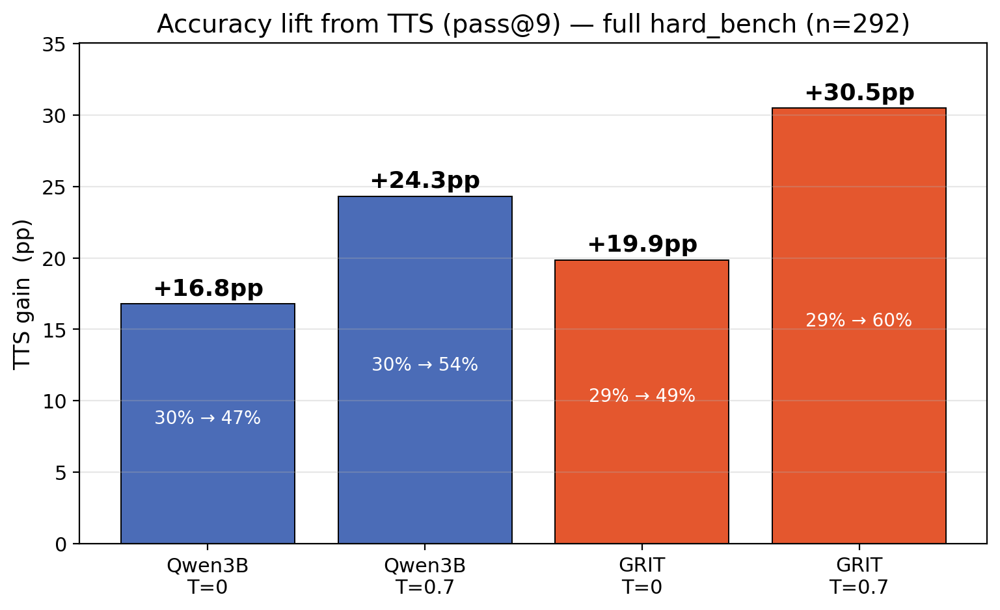
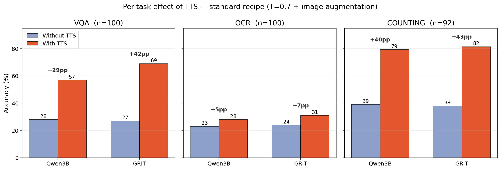
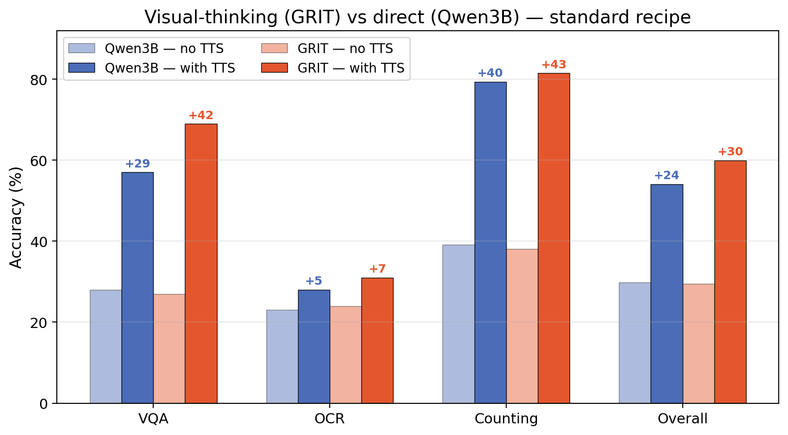
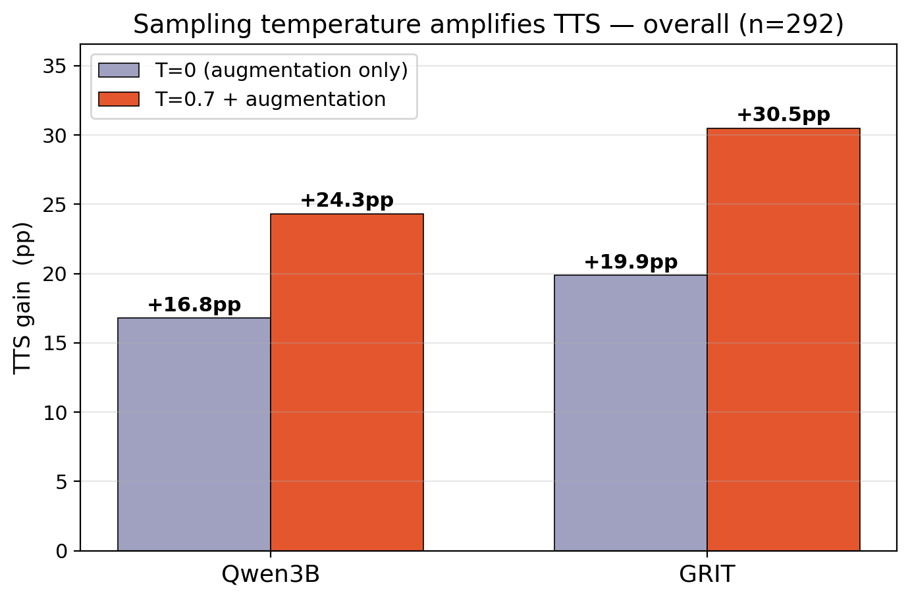
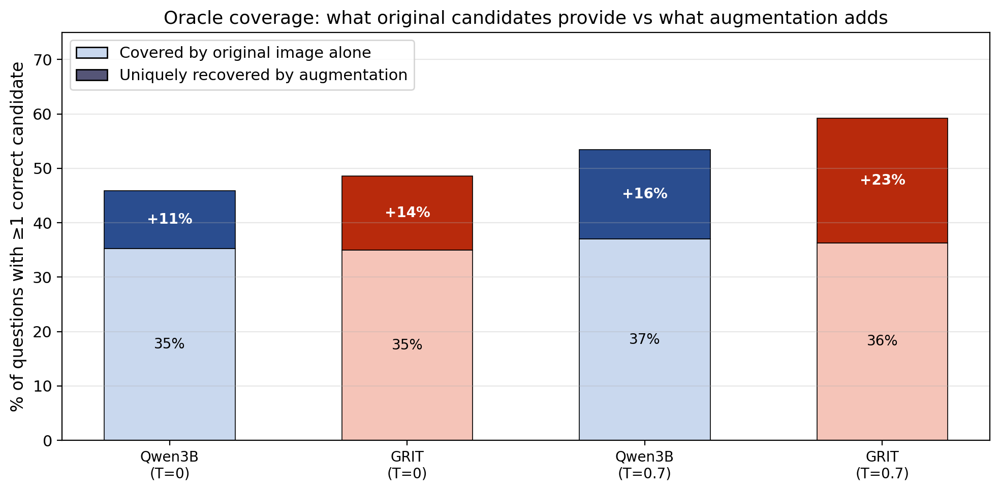

# Test-Time Scaling for Visual Chain-of-Thought Models: Image-Input Diversity as the Key Driver

**Date:** 2026-04-14
**Status:** Runs 1 & 2 (pilot, n=30) + Run 3 (full hard_bench, n=292) complete

---

## 1. Research Question

Can visual chain-of-thought (CoT) models benefit from test-time scaling (TTS) via
majority voting? And if so, what is the source of candidate diversity that makes it work?

We compare two models that share the same 3B Qwen2.5-VL backbone but differ only in
their reasoning strategy:

| Model | Reasoning strategy | Parameters |
|---|---|---|
| **Qwen2.5-VL-3B** | Direct answer (no CoT) | 3B |
| **GRIT-3B** | Visual CoT: think → grounded bbox → rethink → answer | 3B (same backbone) |

This pairing isolates the effect of visual CoT: same capacity, same weights, only the
prompting and fine-tuning strategy differs.

---

## 2. Experimental Setup

### Benchmark

We evaluate on three vision tasks from hard_bench — chosen for hardness (< 60% for
current 7B VLMs), recency (released late 2024), and vision-indispensability:

| Task | Source | Format |
|---|---|---|
| VQA | MMMU-Pro (Sep 2024) | 10-option MCQ, 30 academic disciplines |
| OCR | OCRBench v2 (NeurIPS 2024) | Free-form text extraction, 30 OCR types |
| Counting | MMStar instance-counting (NeurIPS 2024) | MCQ A/B/C/D |

**30 questions per task, per model, per run** (90 per model per run). Questions were
calibrated via a Pass-1 sweep (N=5, T=0.7) to fall in [20%, 70%] accuracy for Qwen3B.

### TTS candidate recipe

Each question generates **9 candidate answers** varying two diversity axes — image
augmentation and temperature:

| # | Image augmentation | Temperature | | # | Image augmentation | Temperature |
|---|---|---|---|---|---|---|
| 0 | Original | 0.0 (greedy) | | 5 | Edge enhance | 0.7 |
| 1 | Original | 0.7 | | 6 | JPEG recompress | 0.7 |
| 2 | Paraphrase | 0.7 | | 7 | Rotation 90 | 0.7 |
| 3 | Brightness +30% | 0.7 | | 8 | Paraphrase 2 | 0.7 |
| 4 | Grayscale | 0.7 | | | | |

Final answer selected by majority vote (plurality) over the 9 candidates.

### Two runs: isolating diversity sources

| Run | Temperature | Image augmentations | Purpose |
|---|---|---|---|
| **Run 1** | Mixed (T=0.0 + T=0.7) | Yes | Full TTS pipeline |
| **Run 2** (T=0 ablation) | All T=0.0 | Yes | Isolate image-augmentation diversity |

Run 2 is the critical experiment: by removing temperature stochasticity, we test whether
image augmentations alone produce useful diversity.

---

## 3. Results

### 3.1 Run 1 — Full TTS pipeline

| | **Qwen3B (direct)** | | | **GRIT (visual CoT)** | | |
|---|---|---|---|---|---|---|
| Task | Greedy | @9 | Oracle@9 | Greedy | @9 | Oracle@9 |
| VQA | 30.0% | 20.0% | 53.3% | 10.0% | 13.3% | 63.3% |
| OCR | 3.3% | 3.3% | 6.7% | 26.7% | 30.0% | 40.0% |
| Counting | 36.7% | 36.7% | 93.3% | 33.3% | 30.0% | 73.3% |

**Figure 5** — Greedy, majority @9, and oracle @9 for both models (30 questions/task).
Two things stand out: (1) TTS gains are small or negative for both models, and
(2) oracle@9 is dramatically higher than @9 — the correct answer is almost always
*present* in 9 candidates but majority voting fails to select it (e.g. Qwen Counting:
93.3% oracle vs 36.7% vote).

### 3.2 The key experiment: Run 1 vs Run 2 (T=0 ablation)

| Model | Task | Run 1 TTS gain | Run 2 TTS gain | What changed |
|---|---|---|---|---|
| Qwen3B | VQA | **-10.0pp** | 0.0pp | Temperature hurt; removing it removes the harm |
| Qwen3B | OCR | 0.0pp | 0.0pp | No diversity source helps |
| Qwen3B | Counting | 0.0pp | -6.7pp | Image augmentations add noise, no useful diversity |
| **GRIT** | **VQA** | **+3.3pp** | **+3.3pp** | **Same gain — temperature was irrelevant** |
| **GRIT** | **OCR** | **+3.3pp** | **+3.3pp** | **Same gain — temperature was irrelevant** |
| GRIT | Counting | -3.3pp | 0.0pp | Removing temperature removes the harm |

**Figure 6** — TTS gain (@9 minus greedy) for both runs. Left: Qwen3B — temperature is
the only diversity source, and it hurts (-10pp VQA). At T=0, image augmentations produce
zero diversity (all @k identical to greedy). Right: GRIT — gains are identical in both
runs (+3.3pp VQA, +3.3pp OCR). All useful diversity comes from image augmentations
passing through the visual grounding step, not from temperature.

---

## 4. Findings

### Finding 1: Visual CoT models benefit from TTS via image-input diversity; direct-answer models do not

The T=0 ablation proves this cleanly. At T=0, Qwen produces the exact same answer
regardless of image augmentation — brightness, grayscale, edge enhance, JPEG, rotation
are all invisible to it. GRIT gains +3.3pp from those same augmentations because its
grounding step (think → bbox → rethink) amplifies small visual perturbations into
different reasoning chains and different final answers.

### Finding 2: Temperature stochasticity hurts majority voting

For Qwen, temperature is the only source of diversity — and it generates wrong candidates
that outvote correct ones (-10pp on VQA). For GRIT, temperature adds nothing beyond what
image augmentations already provide. In both cases, removing temperature helps or is neutral.

### Finding 3: Alternative voting strategies confirm Qwen does not benefit from TTS

The large oracle gap (oracle@9 >> @9) raises the question: is plurality voting just a
bad selector, and would a smarter strategy unlock the gains? We replayed the existing
candidate data under five alternative voting rules:

| Strategy | Rule |
|---|---|
| Greedy tiebreak | Plurality, but ties broken in favor of the greedy answer |
| Consistency filter (k=2,3) | Discard answers appearing fewer than k times, then vote |
| Supermajority (k=3,4,5) | Use greedy unless >= k candidates agree on an alternative |

**Qwen3B — best strategy is greedy itself.** No voting rule improves over the greedy
answer. The most conservative strategies (supermajority_5) simply recover the greedy
baseline, confirming that TTS candidates add only noise for a direct-answer model.

| Qwen3B | Greedy | Plurality | Best strategy | Oracle@9 |
|---|---|---|---|---|
| VQA (n=100) | **27.0%** | 20.0% | supermajority_5: 26.0% | 48.0% |
| Counting (n=92) | 39.1% | 38.0% | supermajority_3: **42.4%** | 91.3% |

**GRIT — voting strategies yield small gains over greedy.** Unlike Qwen, GRIT
benefits from candidate aggregation regardless of the specific voting rule, with
supermajority_3 reaching +10pp over greedy on VQA (Run 2).

| GRIT | Greedy | Plurality | Best strategy | Oracle@9 |
|---|---|---|---|---|
| VQA (n=30, Run 2) | 10.0% | 13.3% | supermajority_3: **20.0%** | 56.7% |
| OCR (n=30, Run 1) | 13.3% | 16.7% | plurality: **16.7%** | 20.0% |

The pattern is consistent: for Qwen, the optimal strategy converges to "just trust the
greedy answer" — TTS adds nothing. For GRIT, multiple voting strategies improve over
greedy, confirming that the visual CoT candidates carry useful signal that aggregation
can exploit. However, all strategies remain far below the oracle, indicating that
answer-level voting alone cannot close the gap — token-level confidence signals or
learned verifiers would be needed.

### Finding 4: Stochasticity does not predict TTS effectiveness

We initially expected CoT models to be more stochastic, making TTS more effective.
A calibrated entropy study (30 questions, 10 draws each at T=0.7) showed the opposite:
GRIT is *less* stochastic than Qwen on all three tasks (entropy delta: -0.23 to -0.47
bits). Yet GRIT benefits from TTS while Qwen does not. What matters is not how much
diversity a model produces, but whether that diversity is *structural* (grounding-driven)
or *random* (temperature-driven).

---

## 5. Scaled validation (n=292) — redefining TTS as pass@9

The pilot results raised one key question: with only 30 questions per task and a
persistent oracle gap, is the TTS effect simply noise, or is there real signal that
a better selector could exploit? We scaled to the full **hard_bench (n=292)** across
all four configurations (Qwen3B × GRIT × standard × T=0 ablation).

**Metric redefinition.** At scale, no answer-level voting strategy beats greedy for
either model (see §5.5). Rather than continue to chase an optimal voter, we fix the
TTS metric to **pass@9** — a question counts as correct under TTS if *any* of the 9
candidates is correct. This is the upper bound a perfect selector could reach, and
it isolates the question we actually care about: *does candidate diversity contain
the right answer?* Closing the gap between pass@9 and a deployable selector is left
as a limitation.

### 5.1 Headline: TTS lifts accuracy sharply on both models

**Figure A** — TTS gain (pass@9 minus greedy) on the full 292-question benchmark.
Every configuration shows a substantial lift; the **standard recipe (T=0.7 + image
augmentations)** yields the largest gains, reaching **+30.5pp for GRIT** and +24.3pp
for Qwen3B overall. Even the pure image-augmentation ablation (T=0) produces
+16.8pp (Qwen) and +19.9pp (GRIT) — confirming at scale the pilot finding that
image diversity alone is a real driver.

### 5.2 Per-task effect and model comparison

**Figure B** — Per-task breakdown under the standard recipe. The two tasks where
models have headroom (VQA, Counting) also show the largest TTS gains (+29–43pp).
OCR gains are modest on both models (+5–7pp), consistent with the pilot: OCR is a
fine-grained exact-match task where augmentations produce fewer *correctly different*
candidates.

**Figure D** — Visual-CoT (GRIT) vs direct (Qwen3B) under the standard recipe.
Baseline accuracy is nearly identical (29.5 vs 29.8% overall), but **GRIT gains more
from TTS** on every task, widening the gap to 59.9 vs 54.1% under pass@9.
The visual-grounding step gives GRIT access to *structurally different* candidates
that direct decoding cannot produce.

### 5.3 Temperature amplifies TTS

**Figure C** — At scale, temperature sampling roughly doubles the TTS gain for both
models (Qwen: +16.8 → +24.3pp; GRIT: +19.9 → +30.5pp overall). This refines Finding 2
from the pilot: temperature *does* generate useful diversity once we measure in the
pass@9 regime — the earlier "temperature hurts" result was specific to plurality
voting, where wrong candidates can outvote correct ones. With a perfect selector,
both diversity sources compound.

### 5.4 Which augmentation drives GRIT's diversity?

To understand where GRIT's candidate diversity comes from, we conditioned on questions
where the original image (T=0) failed and measured how many of those failures each
augmented candidate uniquely rescues — i.e., it is the *only* augmented candidate
that gets the question right.

| Augmentation | GRIT rescue% | Qwen rescue% | GRIT unique | Qwen unique |
|---|---|---|---|---|
| **Rotation 90°** | 12.3% | 12.6% | **10** | 4 |
| Edge enhance + paraphrase | **13.2%** | 13.0% | 4 | 1 |
| JPEG recompress | 10.8% | 12.1% | 5 | 3 |
| Brightness/contrast | 11.3% | 12.1% | 3 | 4 |
| Edge enhance | 11.8% | 11.6% | 1 | 0 |
| Paraphrase (text only) | 10.4% | **14.4%** | 1 | 1 |
| Grayscale | 10.8% | 13.5% | 0 | 3 |

*rescue% = fraction of original-failed questions this slot answers correctly;
unique = questions where this slot is the only correct augmented candidate (T=0 ablation, n=292)*

The **raw rescue rates are nearly identical across all augmentations and across both
models** (11–14%), meaning each augmentation recovers a similar number of failures in
absolute terms. The critical difference lies in *which* questions they recover.
For Qwen, augmented candidates largely rescue the **same questions** — when one
augmentation works, most others do too. For GRIT, **rotation_90 uniquely rescues 10
questions that no other augmentation touches**, and each augmentation type unlocks a
distinct subset of failures.

This is consistent with GRIT's visual grounding mechanism. A 90° rotation fundamentally
changes the spatial layout of the image: objects that were side-by-side become vertically
stacked. GRIT's grounding step predicts bounding boxes before answering, so a rotated
image forces it to attend to a different spatial region, producing a qualitatively
different reasoning chain. Brightness shifts and JPEG compression alter pixel values
but not spatial structure, so the grounding step is minimally affected — and for Qwen,
which has no grounding step, rotation is just another perturbation with no mechanism
to translate spatial change into different reasoning.

**Figure F** — Stacked bars showing how much oracle coverage comes from original-image
candidates alone vs what augmented candidates uniquely add (T=0 ablation).
GRIT gains more from augmentation than Qwen both at T=0 and T=0.7, with the gap
widest under temperature sampling where GRIT's grounding step compounds spatial and
stochastic diversity.

### 5.5 Answer-level voting does not close the oracle gap

At n=292 we replayed six voting strategies (plurality, greedy-tiebreak,
greedy-unless-supermajority, consistency filter, logprob-sum, logprob-mean). For
both models and across all tasks, **no strategy outperforms the greedy baseline**.
Options-logprob voting (restricted to the A–D/A–J subset where options are
well-defined) is no better. This is why we adopt pass@9 as the TTS metric: the
signal is in the candidate pool, but extracting it requires more than answer-level
aggregation.

Full strategy-by-strategy tables are in `results/analysis/scale_results.json`; we
treat selector design as an open problem rather than a contribution of this work.

---

## 6. Limitations

- **TTS metric = pass@9 (oracle upper bound).** Due to time constraints we did not
  identify a voting strategy that matches pass@9; answer-level voting actually
  under-performs greedy at scale. Reported TTS gains therefore represent what a
  perfect selector could achieve, not deployable accuracy.
- **Model pair:** Only Qwen3B vs GRIT-3B tested. DeepEyesV2-7B (agentic CoT) was
  piloted on 3 questions; full evaluation is planned.
- **OCR evaluation** remains conservative due to strict exact-match scoring; edit-distance
  re-scoring is pending.

---

## 7. Next Steps

1. **Selector design to close the pass@9 → deployable gap.** Logprob-weighted voting
   on counting/MCQ subsets and learned lightweight verifiers are the natural next
   experiments.
2. **DeepEyesV2 full evaluation** — test whether the image-diversity finding extends
   to agentic CoT.
3. **OCR re-scoring** with character-level edit distance to separate model error
   from evaluation artifact.
